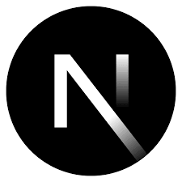
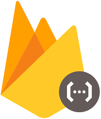
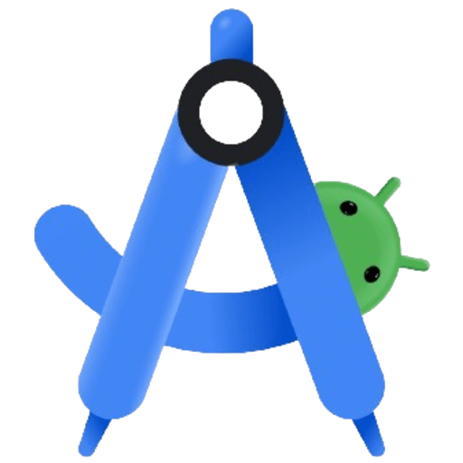
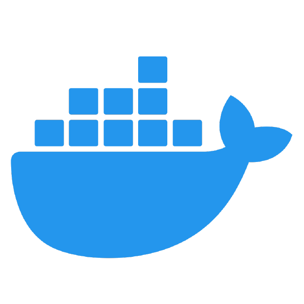
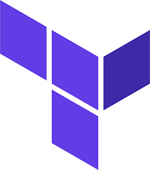
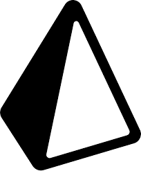
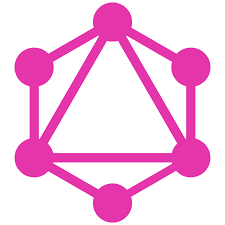

# Hello 👋🏽

My name is Ahnaf and I'm a Web & App Developer based in Edmonton, Albera, Canada 🇨🇦 

I have over 4 years of cummulative experience in Software Development 💻

I completed my Bachelor of Science at the University of Alberta in Computer Science in 2024 🎓

In 2025, I started my company <a href="https://uttarasoftware.ca">Uttara Software</a> to accept any freelance and contract work sent my way. You can <a href="mailto:ahnaf@uttarasoftware.ca">email</a> me yours!

###### &nbsp;

### My Experience

    
🎨 Frontend (4+ years):  React,  Next.js,  Angular,  Vue,  PHP,  CSS,  jQuery

    
🗄️ Backend (4+ years):  Node.js, Express.js,  Flask,  Django,  Firestore Functions

    
📱 Mobile Dev (1+ year):  Flutter,  React Native,  Electron,  Android Studio

    
🛢 Databases:  MySQL,  PostgreSQL,  MongoDB,  Firestore Firestore

    
🌐 Cloud:  AWS,  GCP,  Azure

    
🔧 Dev Tools:  Stripe,  SendGrid,  Docker,  Terraform,  Prisma,  GraphQL

    
✨ UI/UX:  Figma,  Photoshop,  Procreate

###### &nbsp;

### How to reach me

    
✉️ Email: <a href="mailto:ahnaf@uttarasoftware.ca">ahnaf@uttarasoftware.ca</a>

    
&nbsp;LinkedIn: <a href="https://www.linkedin.com/in/ahnav/">linkedin.com/in/ahnav</a>

    
 Company Site: <a href="https://uttarasoftware.ca">uttarasoftware.ca</a>

