

  
  
  
<b>Full-Stack Innovator & App Architect</b>

  
Full-Stack Developer at <a href="https://recyclorobo.ai">Recyclorobo.ai</a> | Founder of <a href="https://uttarasoftware.ca">Uttara Software</a>

  
<i>5+ years of cumulative experience | Graduated with a BSc in Computer Science from the University of Alberta (2024)</i>

  

    
    
    
  

 

### 🌐 Websites I Created

<table width="100%">
  <tr>
    <td width="50%" align="center">
      <a href="https://recyclorobo.ai">
        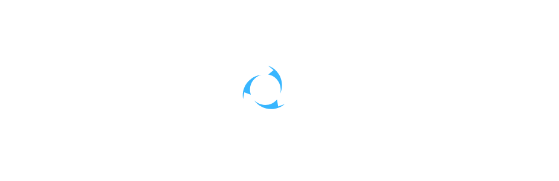
      </a>
       <b>Recyclorobo.ai</b>
    </td>
    <td width="50%" align="center">
      <a href="https://sarcomeredynamics.com/home">
        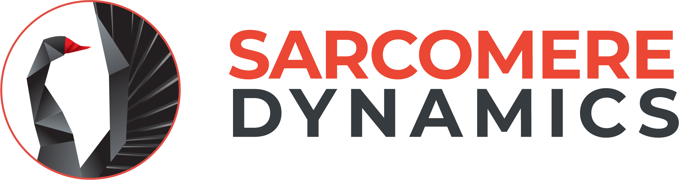
      </a>
       <b>Sarcomere Dynamics</b>
    </td>
  </tr>
  <tr>
    <td width="50%" align="center">
      <a href="https://timesheet-e8ebf.web.app">
        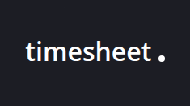
      </a>
       <b>Timesheet</b>
    </td>
    <td width="50%" align="center">
      
       <b>Platypus Toys</b>
    </td>
  </tr>
</table>

 

### 🛠️ My Tech Stack

<table>
  <tr>
    <td width="20%" ><b>🎨 Frontend</b></td>
    <td width="80%">
       &nbsp;&nbsp;&nbsp;
       &nbsp;&nbsp;&nbsp;
      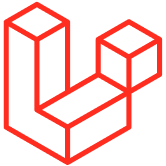 &nbsp;&nbsp;&nbsp;
      
    </td>
  </tr>
  <tr>
    <td ><b>🗄️ Backend</b></td>
    <td>
      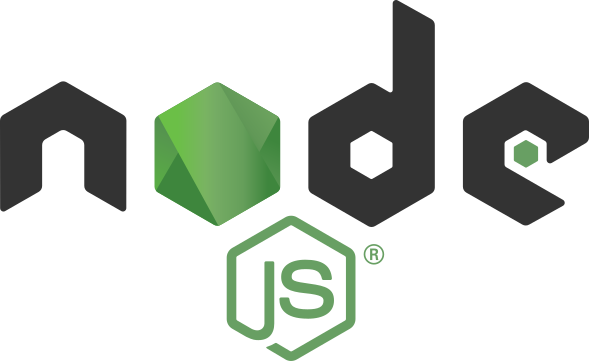 &nbsp;&nbsp;&nbsp;
       &nbsp;&nbsp;&nbsp;
      
    </td>
  </tr>
  <tr>
    <td ><b>📱 Mobile</b></td>
    <td>
       &nbsp;&nbsp;&nbsp;
      
    </td>
  </tr>
  <tr>
    <td><b>🛢️ Databases</b></td>
    <td>
       &nbsp;&nbsp;&nbsp;
       &nbsp;&nbsp;&nbsp;
      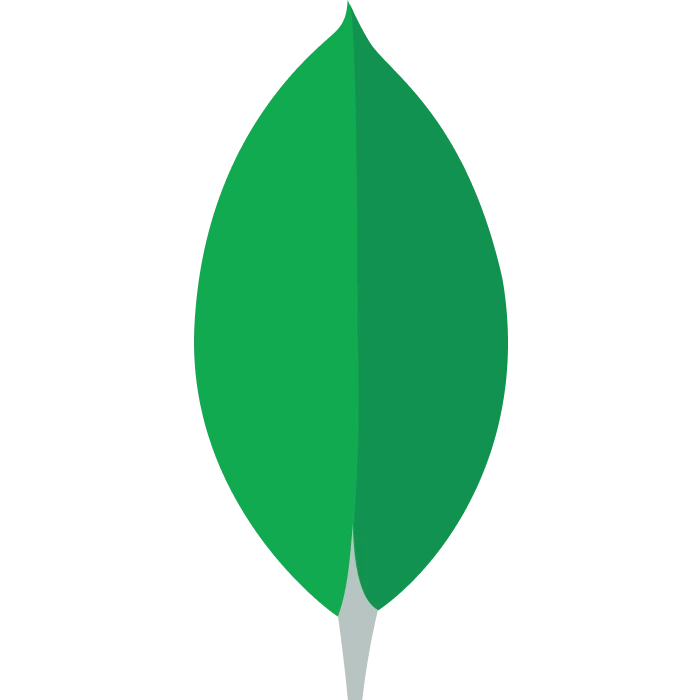 &nbsp;&nbsp;&nbsp;
      
    </td>
  </tr>
  <tr>
    <td><b>🌐 Cloud</b></td>
    <td>
       &nbsp;&nbsp;&nbsp;
      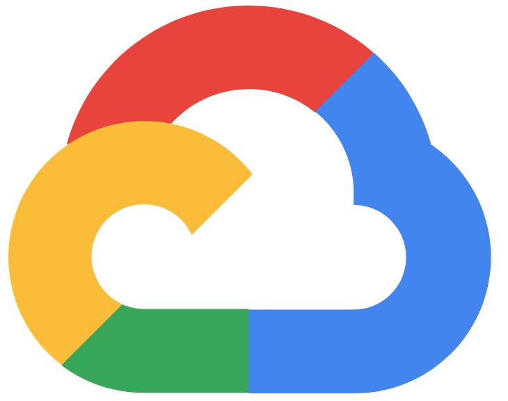 &nbsp;&nbsp;&nbsp;
      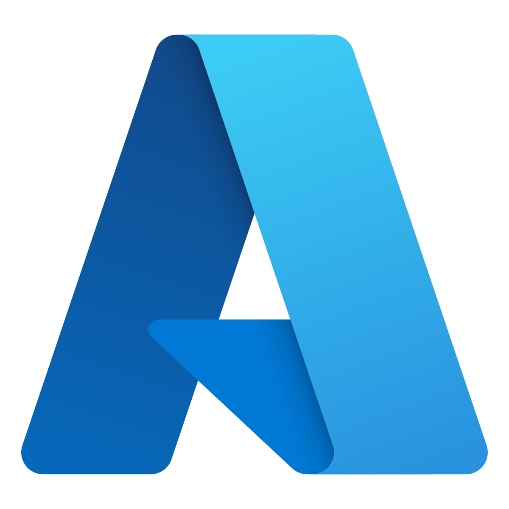
    </td>
  </tr>
  <tr>
    <td><b>🔧 Tools</b></td>
    <td>
      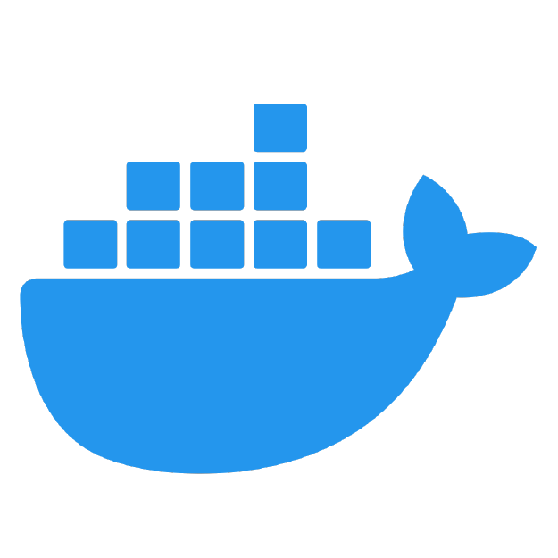 &nbsp;&nbsp;&nbsp;
       &nbsp;&nbsp;&nbsp;
      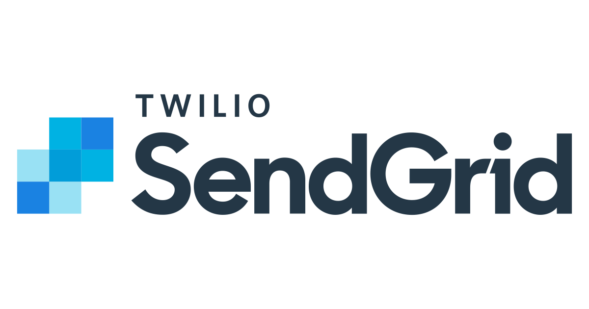 &nbsp;&nbsp;&nbsp;
      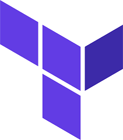 &nbsp;&nbsp;&nbsp;
      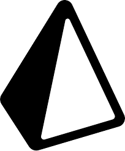 &nbsp;&nbsp;&nbsp;
      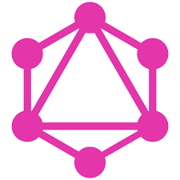
    </td>
  </tr>
</table>

 

### 📊 GitHub Activity

  

 

### 🏆 Profile Stats

  
  

  

 
